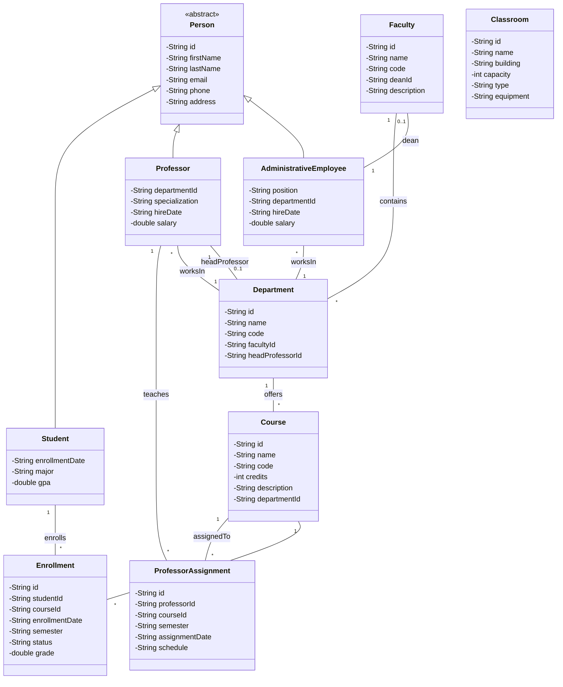

# Diagrama de Clases - Sistema de Control Universitario

## Visualización Mermaid

## Descripción de las Clases

### Jerarquía de Person
- **Person** (Abstracta): Clase base para todas las personas del sistema
  - **Student**: Estudiantes matriculados en la universidad
  - **Professor**: Profesores que imparten cursos
  - **AdministrativeEmployee**: Empleados administrativos

### Estructura Organizacional
- **Faculty**: Facultades de la universidad
- **Department**: Departamentos que pertenecen a facultades
- **Course**: Cursos ofrecidos por departamentos
- **Classroom**: Aulas disponibles en la universidad

### Relaciones
- **Enrollment**: Matrícula de estudiantes en cursos
- **ProfessorAssignment**: Asignación de profesores a cursos

## Relaciones Principales

1. **Herencia**: Student, Professor y AdministrativeEmployee heredan de Person
2. **Composición**: 
   - Faculty contiene Departments
   - Department ofrece Courses
3. **Asociaciones**:
   - Enrollment relaciona Student con Course
   - ProfessorAssignment relaciona Professor con Course
   - Department tiene un headProfessor
   - Faculty tiene un dean (AdministrativeEmployee)

## Cómo visualizar el diagrama

### Opción 1: PlantUML
1. Instalar la extensión PlantUML en tu IDE
2. Abrir el archivo `class-diagram.puml`
3. Usar la vista previa de PlantUML

### Opción 2: Mermaid
- Este archivo `.md` se puede visualizar en:
  - GitHub
  - GitLab
  - VS Code con extensión Mermaid
  - Cualquier visor de Markdown compatible con Mermaid

### Opción 3: Online
- PlantUML: https://www.plantuml.com/plantuml/uml/
- Mermaid: https://mermaid.live/
